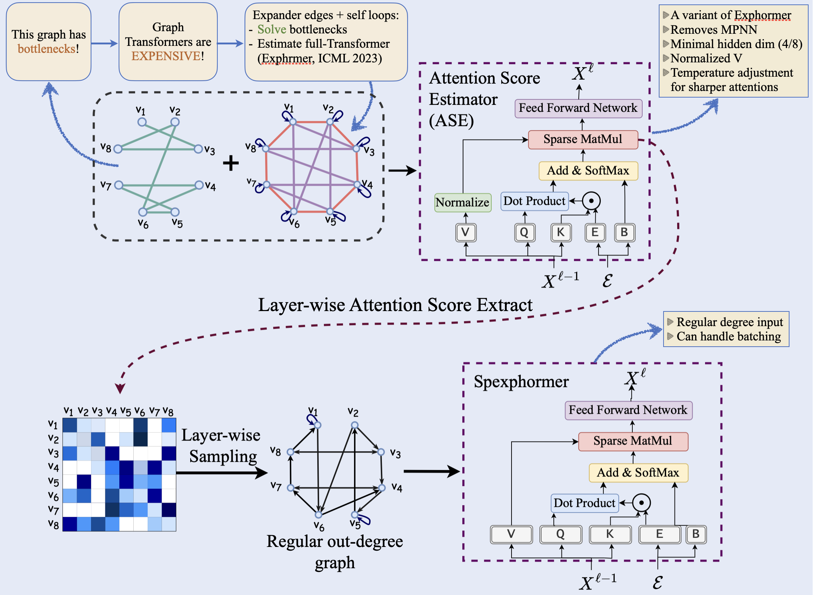

# Spexphormer: Even Sparser Graph Transformers




Attention edges enable global information propagation at the cost of larger computational complexity. Aside from the computational complexity, batching without blindly losing the global information propagation seems impossible. 
But, are all these attention edges important? Many investigations suggest, no. How to identify the less important edges? We built on the Exphormer model, by first training a very low-dimensional network and gathering the attention scores. Then these attention scores will help to prune the attention map, helping with the batching process and also leading to a faster model.


### Python environment setup with Conda

```bash
conda create -n spexphormer python=3.12
conda activate spexphormer

# check for your cuda version first
conda install pytorch=2.3.0 torchvision torchaudio pytorch-cuda=12.1 -c pytorch -c nvidia
conda install pyg -c pyg

pip install torchmetrics
pip install yacs
pip install ogb
pip install tensorboardX
pip install wandb
pip install bottleneck

conda clean --all
```


### Running Exphormer
```bash
conda activate spexphormer

# Running the attention score estimator (ASE) network for the Actor dataset:
python main.py --cfg configs/heterophilic/actor/actor_ASE.yaml wandb.use False

# Training the spexphormer after the attention score estimation, experiment will run for 5 random seeds 0-4:
python main.py --cfg configs/heterophilic/actor/actor_spexphormer.yaml --repeat 5 wandb.use False
```

After running the ASE codes, the attention scores will automatically be saved in the 'Attention_scores' directory. The Spexphormer code will read the attention scores and perform the sampling.


### W&B logging
To use W&B logging, set `wandb.use True`.